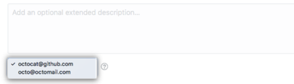

# This has no frontmatter

Hopefully there is a test image below

Some text  then more text.

3rd attempt relative image  Adding some text to the other side to see how text wrapping around an image works by default. Here is a line of text. Here is a line of text. Here is a line of text. Here is a line of text. Here is a line of text.
4th attempt direct image 
